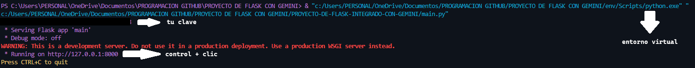

# PROYECTO DE FLASK INTEGRADO CON GEMINI
## Características Destacadas:

### Flask Framework: 
Utilizando Flask, el proyecto aprovecha la simplicidad y flexibilidad de este framework web de Python para construir una aplicación sólida y fácil de mantener.

### Integración con Gemini: 
La integración con Gemini agrega una capa adicional de funcionalidad, permitiendo explorar y aprovechar las características avanzadas de Gemini dentro del contexto de una aplicación web Flask.

### Desarrollo Ágil: 
Diseñado para facilitar el desarrollo ágil, el proyecto ofrece una estructura organizada y modular para impulsar la productividad del desarrollador.

### Escalabilidad y Rendimiento: 
Con el respaldo de Flask y la integración con Gemini, el proyecto está diseñado para ser escalable y mantener un rendimiento óptimo incluso en aplicaciones web complejas.

## Objetivo del Proyecto:

El objetivo fundamental es proporcionar a los desarrolladores una base simple para la construcción de aplicaciones web dinámicas y la capacidad de aprovechar las características únicas de Gemini en un entorno Flask.
Este diminuto proyecto nos ayduara a comprender conceptos del nuevo proyecto de google gemini!

<br>

> [!NOTE]
> Puedes ejecutar el programa localmente sigueinte los siguendo los sigueintes pasos:

### 1. Clona el repositorio del proyecto:

```
git clone https://github.com/titooDiaz/PROYECTO-DE-FLASK-INTEGRADO-CON-GEMINI.git
```

o puedes  descargarlo como un archivo zip desde GitHub.

[Repositorio](https://github.com/titooDiaz/PROYECTO-DE-FLASK-INTEGRADO-CON-GEMINI.git)

### 2. Instala las dependencias necesarias utilizando pip (Python Package Index):

puedes usar el sigueinte comando en la terminal o cmd para instalar las dependecias:

> [!CAUTION]
> Recuerda que peude ser importante tener un entorno virtual 
> Para instalar las bibliotecas alli sin la necesidad de instalarlas en tu computadora

```
pip install virtualenv
```

> [!CAUTION]
> Segun tu version de python puedes hacerlo de dos formas:
>
> ```
> python -m venv env
> ```
>
> o
>
> ```
> virtualenv env
> ```

Una vez creado el entorno, `activalo` con este comando:

```
env/scripts/activate
```

<br>

Descarga los paquetes:
```
pip install requirements.txt
```


### 3. Correr el programa

Retrocede una carpeta en tu consola

```
cd ..
```
> [!CAUTION]
> En esta localizacion crea un archivo llamado `.env`, y dentro pon las siguientes variables de entorno
> <br>
> Por ejemplo:
> <br>
> API_KEY=Est0000EsUnn3JEMmpl000
> <br>
> Puedes conseguir tu propia clave [aqui](https://makersuite.google.com/app/apikey)

<br>

Cuando tengas todos los paquetes instalados y el entorno activado, solo debes correr el archivo `main.py`.
debera ejecutarse en el puerto 8000 de tu computadora
<br>
Para abrir el servidor dale `control + clic` en la url de la consola

#### Aqui tienes un ejemplo de como debe verse:
Localizacion de tus archivos:
<br>
<p align="center">
  
</p>

al correrlo:
<br>
<p align="center">
  
</p>